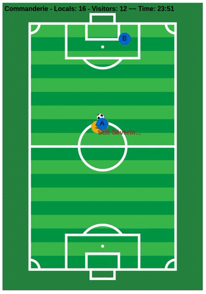

# demo-mesh-arena

## Slides

This demo was presented at the [Devops D-Day 2018](https://www.youtube.com/watch?v=xRIKThyltno) in the Velodrome, Marseilles' famous stadium.
[Here are the slides](https://docs.google.com/presentation/d/1PzRD3BquEI3Al6y2_vSrZqUY0AlJF54_uuWYhr81t5g), in French. Or a similar [English version](https://docs.google.com/presentation/d/1WZDmIcfzKC9GMqz8Cvcb0_mJK_hIH-JxEDROZLnEnng).

## Step-by-step

For a step-by-step walk-through, [read this](./STEP-BY-STEP.md) (outdated - you might run through the "scenario" steps instead, read `make man`).

## Pre-requisite

- Kubernetes cluster running
- Istio installed (much better with Kiali!)
- `yq` might be needed at some point, if you use deploy targets; grab it from there: https://github.com/mikefarah/yq/releases (Last version known to work here: 3.1.1)

## Quick start

This quick start doesn't require you to clone the repo, but offers less interactivity.

If not already done, enable istio injection:
```bash
kubectl label namespace default istio-injection=enabled
```

*Note: though not mandatory, it's the main purpose of this demo to use Istio networking rules. The demo will still run without Istio.*

Run one of the commands below:

```bash
# With app metrics enabled:
kubectl apply -f <(curl -L https://raw.githubusercontent.com/jotak/demo-mesh-arena/zizou/quickstart-metrics.yml) -n default

# With app traces enabled:
kubectl apply -f <(curl -L https://raw.githubusercontent.com/jotak/demo-mesh-arena/zizou/quickstart-tracing.yml) -n default

# With both enabled:
kubectl apply -f <(curl -L https://raw.githubusercontent.com/jotak/demo-mesh-arena/zizou/quickstart-both.yml) -n default

# With none enabled:
kubectl apply -f <(curl -L https://raw.githubusercontent.com/jotak/demo-mesh-arena/zizou/quickstart-naked.yml) -n default

# Interactive mode:
kubectl apply -f <(curl -L https://raw.githubusercontent.com/jotak/demo-mesh-arena/zizou/quickstart-interactive.yml) -n default
```

In the interactive mode, players won't shoot by themselves, they need a human interaction. To shoot, click on a player, enter your name, then click the "shoot" button.

## Expose UI



```bash
kubectl -n default port-forward svc/ui 8080:8080
```

Open http://localhost:8080.

## Quick start with Kafka

By default, the mesh-arena services use simple HTTP endpoint to communicate.
There's a Kafka switch that turns on using Kafka messaging for some communications.
Run the following instructions to turn it on: 

```bash
# Create a namespace for Kafka
kubectl create namespace kafka

# Install Kafka (Strimzi-powered)
kubectl apply -f 'https://strimzi.io/install/latest?namespace=kafka' -n kafka
kubectl apply -f <(curl -L https://raw.githubusercontent.com/jotak/demo-mesh-arena/zizou/k8s/strimzi.yml) -n kafka

# Wait a little bit that everything is ready
kubectl wait pod messaging-kafka-0 --for=condition=Ready --timeout=600s -n kafka

# Deploy mesh-arena services with Kafka turned on
kubectl apply -f <(curl -L https://raw.githubusercontent.com/jotak/demo-mesh-arena/zizou/quickstart-kafka.yml) -n default
```

This is more or less equivalent to this make command: `make kafka-se deploy-kt`

## Advanced

- Clone this repo
- Read the manual!

```bash
make man
```

It covers a bunch of make targets, deployment options, Istio scenario, with or without Kafka, etc.
