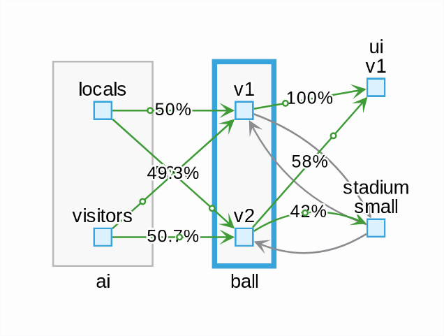
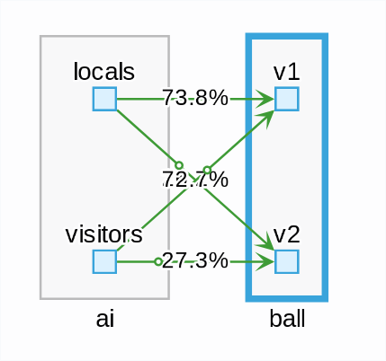
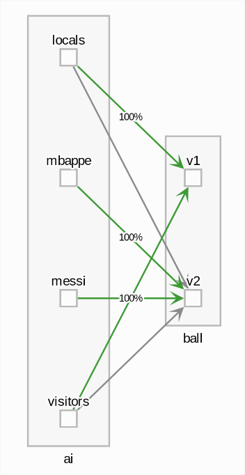
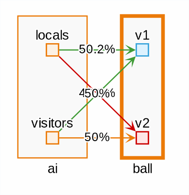
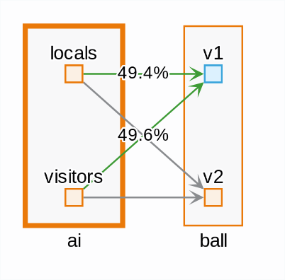
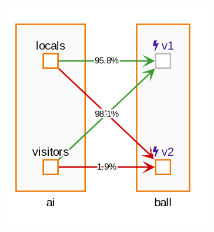

# Mesh Arena

This is a step-by-step guide to run the demo.

## Slides

This demo was presented at [DevopsDday](http://2018.devops-dday.com/) in the Velodrome, Marseilles' famous stadium, and then at [RivieraDev 2019](https://rivieradev.fr/).
Check the slides, [in French](https://docs.google.com/presentation/d/1PzRD3BquEI3Al6y2_vSrZqUY0AlJF54_uuWYhr81t5g) (a bit outdated) or [in English](https://docs.google.com/presentation/d/1WZDmIcfzKC9GMqz8Cvcb0_mJK_hIH-JxEDROZLnEnng).

## Pre-requisite

- Kubernetes or OpenShift cluster running (ex: minikube 0.27+ / minishift)
- Istio with Kiali installed

### Example of Istio + Kiali install:

```bash
istioctl install --set profile=demo
kubectl apply -f https://raw.githubusercontent.com/istio/istio/release-1.10/samples/addons/prometheus.yaml
kubectl apply -f https://raw.githubusercontent.com/istio/istio/release-1.10/samples/addons/kiali.yaml
kubectl apply -f https://raw.githubusercontent.com/istio/istio/release-1.10/samples/addons/jaeger.yaml
istioctl dashboard kiali
```

## Get the yml files locally

- Clone this repo locally, `cd` to it.

```bash
git clone git@github.com:jotak/demo-mesh-arena.git
cd demo-mesh-arena
```

For OpenShift users, you may have to grant extended permissions for Istio, logged as admin:
```bash
oc new-project mesh-arena
oc adm policy add-scc-to-user privileged -z default
```

## Jaeger

Tracing data generated from microservices and Istio can be viewed in Jaeger by port-forwarding
`jaeger-query` service.

```bash
istioctl dashboard jaeger
make jaeger-service
```

AI service generates trace named `new_game` for each game. This way we are able to trace player's
movement on the stadium.

The other interesting trace is from `ui` service called `on-start` it captures all initialization
steps performed at the beginning of the game.

## Deploy microservice UI

```bash
kubectl label namespace default istio-injection=enabled
make scen-init-ui
```

## Deploy stadium, ball, 2x2 players

```bash
make scen-init-rest
```

or, one by one:

```bash
make scen-init-stadium
make scen-init-ball
make scen-init-ai
```

<details><summary>Kiali TIP</summary>
<p>
In Kiali Graph, we may want to disable the Service Node display
 (because it hides some workload-to-workload relations) and also turn on Traffic Animation (because it's prettier!).
</p>
</details>

## Second ball

```bash
make scen-add-ball
```

In this state, the usual K8S load balancer is in use.
Players can't seem to decide whether to go to first or second ball. The round-robin algorithm makes them change their target on every request.

<details><summary>Kiali TIP</summary>
<p>
In Kiali Graph, double-click on ball app (the rectangle)
to better visualize this 50-50 distribution.
Also, you can type `app=ui OR app=stadium` in the Hide box to reduce noise.
</p>


</details>

## Ponderate ball v1 and v2

```bash
make scen-75-25
```

Players know a little bit better where to go, but still unsure.

<details><summary>Kiali TIP</summary>
<p>
In Kiali Graph, distribution will be slowly moving close to 75/25.
</p>


</details>

## Messi / Mbappé

```bash
make scen-add-players
```

Two new players.

## Each his ball

```bash
make scen-by-source-label
```

Now they know. Clean state.

<details><summary>Kiali TIP</summary>
<p>
This is how it should looks like: 100% to a ball.
</p>


</details>


## Reset

```bash
make scen-reset
```

## Burst ball (500 errors) with shadowing

```bash
make scen-add-burst
make scen-mirroring
```

A new ball, v2 is deployed "for fake": all requests sent to v1 are duplicated to v2.
But the players don't "know" about that: from their PoV their requests are for v1 only.
They don't get responses from v2.

The new ball sometimes (randomly) returns errors.
When it does so, it turns red.

<details><summary>Kiali TIP</summary>
<p>
In Kiali Graph, when you double-click on ball app,
Kiali displays metrics emitted by balls => so there's incoming traffic to v2.
</p>



<p>
But if you double-click on ai app, Kiali displays metrics emitted by AI => there's no outgoing traffic to ball v2.
</p>


</details>

## Remove shadowing, put circuit breaking

```bash
make scen-outlier
```

CB is configured to evict failing workload for 10s upon error.
Then it's put back into the LB pool, and will be evicted again, and again, and again.

When a ball receives no request, it turns darker. So it's grey when it's evicted by the circuit breaker.

<details><summary>Kiali TIP</summary>
<p>
In Kiali Graph, double-click on ball app.
You will see some low proportion of requests from ai to ball-v2,
corresponding to the time when it's put back in LB pool.
</p>


</details>

## To clean up everything

```bash
make undeploy
```
